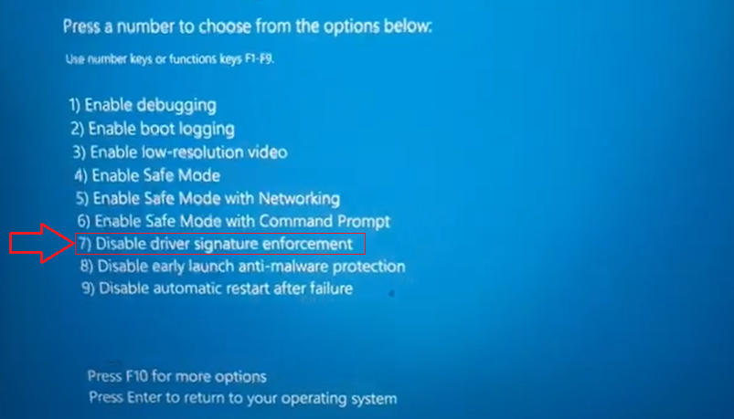

# Drivers of Beagle Bone Black board
You can get these drivers after connecting a Beagle Bone Black board to your PC/laptop by USB cable. This repository is just a backup download link

With the latest images, _it should no longer be necessary to install drivers_ for your operating system to give you network-over-USB access to your Beagle. In case you are running an older image, an older operating system or need additional drivers for serial access to older boards, download the old drivers in `/Drivers` folder.

For Windows users, **BONE_D64.exe** is used to install on Windows (64-bit) and **BONE_DRV.exe** on Windows (32-bit).

## Troubleshooting
If you cannot install drivers on Windows 10 then maybe you need to **disable driver signature enforcement** before installing drivers if you are using Windows 10.

Go to **Setting > Updates & Security > Recovery > Advanced startup >** click on **Restart**

After restarting, Windows switch to **Advanced startup** mode. Go to Troubleshoot > Advanced options > Startup settings > click on Restart

After restarting, press **F7** to select **Disable driver signature enforcement**
https://stackoverflow.com/questions/52065512/cannot-install-the-driver-of-beaglebone-on-the-windows-10

